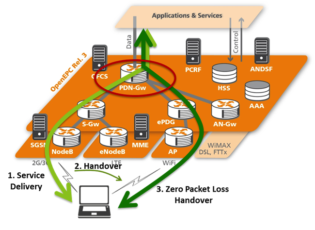

```````````````````````````````
FLEXCare Extensions 
```````````````````````````````

.. contents:: Table of Contents

LTErf
=====

The main extension FLEXCare provides to the FLEX community is the integration of the OpenEPC into the LTErf EPC service. This enables FLEX experimenters to reuse existing experiment descriptions based on the prior supported EPC implementations from SIRRAN and the OAI EPC.

LTErf is based on modular Ruby source code, which makes it uncomplicated to add additional services. For the OpenEPC on the other hand, an overlay API has been developed that now allows remote management of parameters defined in the LTErf EPC service API.

Additional to the integration of the OpenEPC two other API are going to be implemented that will provide additional valuable features to remote experimenters.

The first of these API's is controlling the attenuator. For security reasons it is currently under discussion if experimenters should be able to control the attenuator directly using tools like netcat or telnet. Table 7 shows the LTErf API extension regarding the attenuator.

================ ======================== =========================
Feature          Example                  Description
================ ======================== =========================
Component status attenuator/dev=1&&status Status information about current attenuation levels
Set attenuation  attenuator/dev=1&&dB=20  Sets attenuation level to a dB value
================ ======================== =========================

Table: LTErf Attenuator API

The second API will allow experimenters to emulate core network parameters to mimic different environmental influences. Parameters supported are: bandwidth, packet loss, latency.

======================== ======================== =========================
Feature                  Example                  Description
======================== ======================== =========================
Network parameter status netem/param=PL           Status information about specific network parameter emulation
Set Network parameter    netem/param=PL&&value=20 Sets specific parameter emulation values
Reset                    netem/reset              Resets all values
======================== ======================== =========================

Table: LTErf Network Parameter Emulation

Additional Services and capabilities
====================================

Mobility Manager
----------------

The Mobility Manager has the role of orchestrating the mobile client attachment/detachment procedures during the hand-over operations from one Access Network to another. As such, it allows for a seamless experience for the EPC clients, by managing the IP connectivity layer operations. It provides wrapper functions to connect and disconnect from each individual access network available, by reusing the client device's standard Layer 2 and 3 attachments. For orchestrating smooth hand-overs, the actual connection and final selection of a connection are provided with a fine-grain control mechanism to be used from the application layers, or managed transparently by the Mobility Manager based on Inter-System Mobility Policies, received from the ANDSF.

The Mobility Manager implements the ANDSF S14 interface, which allows for exchange of information between the core network and the clients. With this mechanism in place, the Mobility Manager can provide to the ANDSF its updated network location and connectivity information and can receive from the ANDSF coverage maps in the form of Access Network Discovery Information and hand-over indications in the form for Inter-System Client Mobility Policies.

Based on the operator pushed Inter-System Mobility Policies, the MM can handle transparently (if configured as such by the subscriber) the operator's indications and requests. Besides this network-triggered hand-over mechanism, of course, manually triggered hand-overs on subscriber request are supported and have the highest priority over the network-triggered ones.

For performing all these operations and for retrieving IP connectivity information, the MM exports an open API towards the client application layer, which allows for easy integration with existing and future applications, mobile frameworks and platforms.

The current MM software was completely overhauled with new functionality enabling apart from the orchestration of the mobility also resource management in the UE. Additionally, the mobility manager is able to offer location based services with various location feeders such as GPS, cell-based, ANDSF based, through Over-The-Top communication. Additionally, the MM integrates with the various access network, through fine granularity control of the 3GPP modem and through the support of non-3GPP authentication procedures.

Seamless Vertical Handovers
---------------------------

The communication over the wireless access networks, due to the inherent cellular structure requires handovers between the same of different access technologies. However short, due to the requirement that the data traffic is redirected from the source location in the network to the target location, these handovers introduce an interruption in the communication between the mobile device and its correspondent nodes. In order to be able to offer a similar experience to the users, the research community studied different approaches for the seamless handovers.


Figure: Vertical handover scenario

OpenEPC provides the means to transparently handover the active sessions of a mobile device between the different access networks including LTE, other 3GPP and non-3GPP accesses. The effect of vertical handovers can be showcased separately or together with the Always Best Connected scenario using the OpenEPC applications: real-time applications including video streaming as an IMS service, as a plain SIP service and as Internet service (through the web browser).

Following the internal R&D of Fraunhofer FOKUS, OpenEPC includes a zero packet loss vertical handover solution, which does not require external functionality such as buffering. This is done through an extension of the functionality for mobility management in the PDN GW. It executes the handover of the downlink connectivity only when the connection over the target access network is completely established (real make-before-break handovers). The mechanism included in OpenEPC was developed in the spirit of the 3GPP standardization and targets future introduction into the 3GPP EPC.
