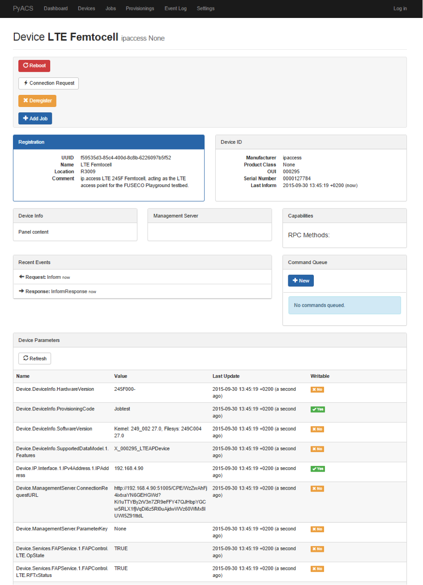

```````````````````````````````
FLEX Integration
```````````````````````````````

.. contents:: Table of Contents

This section provides an overview how the FUSECO testbed is integrated in the FLEX project. The main scope thereby lies on the interfaces provided by FLEXCARE, which can be used by FLEX experimenters.

Architecture
============

The figure below gives an overview of the resource provisioning and control architecture implemented. 

Provisioning access of resources to experiments is handled by the `FITeagle <http://fiteagle.org>`_ tool and its SFA interface. On top of this interface any suitable SFA client may be used, but the FLEXCare testbed provides an MySlice portal for enabling experimenters an easy way to list and reserve the offered resources.

For experiment control the main difference to the architecture proposed in D1.1 lies in the addition of the `LTErf <http://nitlab.inf.uth.gr/NITlab/index.php/testbed/lte-experimentation/lte-omf-am-service?id=464>`_ service, instead of using the FRCP capabilities within FITeagle. It is now used to provide information and control capabilities of the `OpenEPC <http://www.openepc.com/>`_ network and the deployed `ip.access <http://www.ipaccess.com/>`_ (LTE245F) eNodeB to experimenters. To achieve this integration, an extension for LTErf was developed, which integrates the OpenEPC into the homogenous FLEX tool environment. 


Additionally, an extension to LTErf is proposed in development that enables a `JFW Industries <http://www.jfwindustries.com/>`_ attenuator to be controlled by experimenters. This will allow them fine-grained manipulation means on LTE radio layer.

Control and Experimentation Plane
=================================

As stated in the `FLEX deliverable 2.1 <http://www.flex-project.eu/images/deliverables/FLEX_WP2_D2.1_final.pdf>`_ , the Slice Federation Architecture (SFA) is chosen to provide the control plane functionality. For that purpose FITeagle supports the `GENI Aggregate Manger V3 API <http://groups.geni.net/geni/wiki/GAPI_AM_API_V3>`_.

The SFA module is also responsible for translating the internally used semantic resource model, based on the ontologies defined within the joint GENI/FIRE Open-Multinet consortium, to RSpecs.

The RSpec extensions defined in FLEX deliverable 2.1 will be supported by the translation mechanism, in order to make sure that the testbed can be integrated into the FLEX project and FIRE ecosystem in general.

FITeagle
--------

`FITeagle <http://fiteagle.org>`_ is a semantic- and microservices-based resource management toolkit for federated infrastructures, such as testbeds. On the north bound FITeagle provides a set of well-defined interfaces to cover the whole experimentation lifecycle. This includes native Representational State Transfer (REST) based APIs as well as SFA, FRCP and OML.

Resources, on the other hand, are interfaced by the southbound interfaces (Figure 4). A resource in this context can be a physical or virtual resource (e.g. the ACS and the OpenEPC).

An adapter is responsible for describing, provisioning, controlling and monitoring a single or multiple resources and their instances by publishing, receiving and subscribing to semantically annotated information.

As one of the main aspects of FITeagle is its resource centeredness, the implementation of different protocols (delivery mechanisms) is achieved transparently to the underlying resources. Therefore the resource adapters implemented for the ACS, the OpenEPC and the UE’s can focus on the functionality of the resource and do not have to deal with protocol specific conditions. 

The core functionalities, such as a resource repository, reservation management, orchestration, elasticity or authorization decisions are located in the westbound area. Requirements for these modules are derived by identifying common functionalities needed in the northbound interfaces. Finally, the integration of existing services is located at the eastbound area. This includes services such as an `OML Measurement Stream protocol service <http://oml.mytestbed.net/projects/oml/wiki/>`_ enabling resource and experiment monitoring.

Auto Configuration Server
-------------------------

The Auto-Configuration Server (ACS) is the central configuration management component for the CPE WAN Management Protocol (`CWMP <https://www.broadband-forum.org/cwmp.php>`_) from Broadband Forum’s TR-069 specification. CWMP clients periodically (and on certain events) connect to the ACS in order to exchange data and retrieve commands.

Using CWMP, device parameters as specified in TR-181 and TR-196 can be read and written. The parameters can also be set up to trigger a notification when their value changes.
 



Figure: Screenshot ACS - LTE 245F

PyACS is a new Python implementation that exposes the ACS service through WSGI and features a web frontend as well as a RESTful API using the Django Web Framework. It features changing devices on multiple devices in one job, provisioning devices with preset parameters, as well as parameter backup and restoration.

Figure 5 shows the web GUI of the PyACS, it shows general information about the connected femto cells, as well as parameter states and write ability. Additionally, it is possible to connect, disconnect, reboot and change parameters (by adding a new job) of the femto cell.

Adoption of the OMF Framework
-----------------------------

To allow remote accessibility to the research community and to allow users to run experiments that involve multiple testbeds, the testbed offers an FRCP/`OMF 6 <http://mytestbed.net/projects/omf6/wiki/Architectural_Foundation>`_ interface. FITeagle provides according APIs for experiment control. The FITeagle FRCP module thereby creates proxy instances for the resources, thus enabling access control and resource specific command restriction. Figure 6. shows the message flow for an experimenter using the OMF 6 Experimenter Client.


Figure: FITeagle FRCP

In favour of future extensibility and further development it was decided to provide version 6 of OMF only.

Support of the OML Library
--------------------------

Support of the OML library to collect measurements within the experiment through direct TCP socket connections is achieved by FITeagle’s OMSP service interface. The data is provided either by OML wrappers running on the resource (e.g. measuring bandwidth usage on the PGW inside the EPC) or is gathered indirectly by the adapters (e.g. by querying the ACS for current state of the eNodeB).

Integration into the Broker and Scheduler entities
--------------------------------------------------

As stated above, FITeagle implements the GENI AM v3 SFA interface. As such it is prepared to be queried by the Broker and Scheduler entities of the FLEX federation.

Usage and Extension of the LTErf OMF-based service
--------------------------------------------------
As the LTErf currently does not support the OpenEPC it was decided to provide LTErf’s functionality by other means. 

* Control of the access network is provided by the ACS’ REST API which is also exposed via FITeagle’s FRCP interface. 
* Control of the QoS parameters of the EPC components is achieved by the OpenEPC adapter. 

