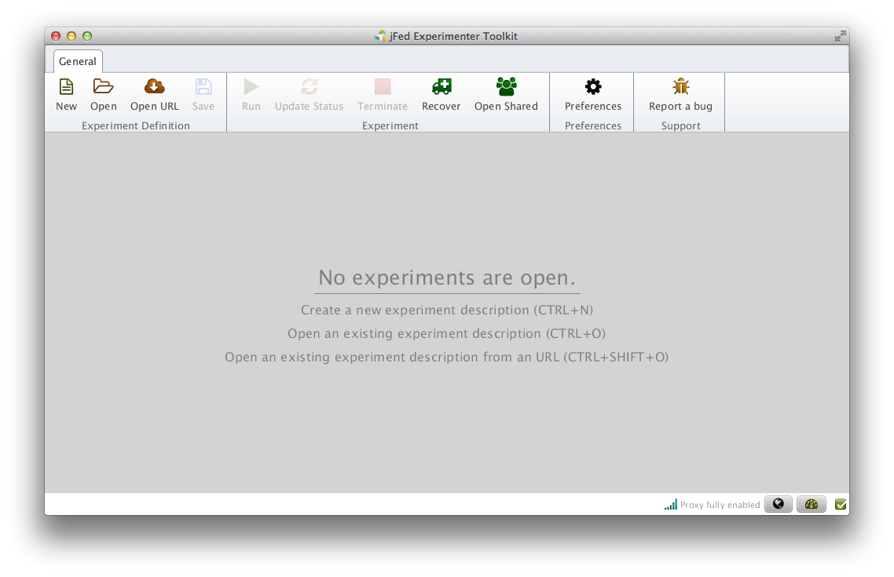

.. FLEXCARE documentation master file, created by
   sphinx-quickstart on Thu Dec 17 01:27:49 2015.
   You can adapt this file completely to your liking, but it should at least
   contain the root `toctree` directive.

Welcome to FLEXCARE's documentation!
====================================

lorem ipsum

test1
.. figure:: new_Experiment.png
test2

Contents:

.. toctree::
   :maxdepth: 2

Indices and tables
==================

* :ref:`genindex`
* :ref:`modindex`
* :ref:`search`

