````````````````````````````````````
Remote access and experiment control
````````````````````````````````````

.. contents:: Table of Contents

Experimentation Life Cycle
==========================

The experimentation life cycle of the `FUSECO Playground <http://www.fuseo-playground.org>`_ starts with the listing of resources being provided by the infrastructure. Afterwards the experimenter defines its experiment and involving requirements.

When this is done the experimenter uses its SFA client to reserve the identified resources needed for the execution of his research and experiments. 

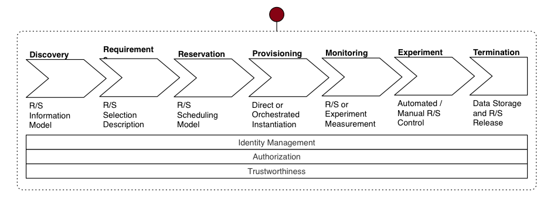

The actual experiment starts with the provisioning phase. There the required resources get instantiated and access to them is established. If desired, monitoring nodes are being configured and the experiment is conducted. The life cycle ends with the termination, this means the release of resources and remove of user access.

UE Level
==============

From the experimenter point of view, the UE’s provide the point of entry to the testbed. These are the only resources external researchers will have direct access to. To enable themselves to access the UE’s, the experimenters use a suitable SFA client to install the public SSH-key of the experimenter. Figure 3 shows the definition of an experiment environment on the FLEXCare testbed using the `jFed Experimenter GUI <http://jfed.iminds.be/>`_. 

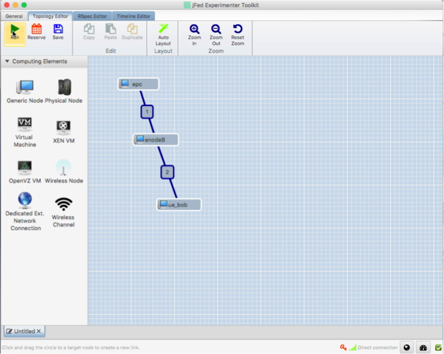

Within the provisioning phase the user’s SSH-key, which is part of the SFA-based request, is deployed on the UEs and the experimenter can open a terminal and connect to the device (shown in figure below). 

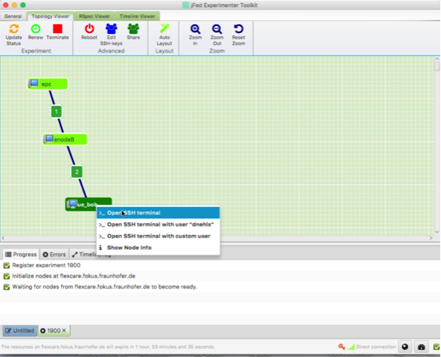

The FUSECO Playground consists of two different types of user equipment (UE). First type are the Linux UEs, which are installed on a small form factor PCs (Lenovo M93 Tiny), which have an on-board Wi-Fi chip and a selection of USB modem are available in order to establish LTE connectivity. The second type of UEs are Android smart phones (Samsung Galaxy S4), which are able to connect to the available access networks.

Each of the UEs contains a pre-provisioned SIM card. Therefore, the UEs have a default assigned username which provides a ready to be used testbed setup without dealing with user configuration and provisioning. The assignment of user IDs could be changed on request, which would include a physical relocation of SIM cards.

List of pre-provisioned users:

======== =============== ==================== =================
Username IMSI            OS                   Hardware
======== =============== ==================== =================
Alice    001021234567890 Linux (Ubuntu 14.04) Lenovo M93 tiny
                                              Huawei K5005
Bob      001021234567891 Linux (Ubuntu 14.04) Lenovo M93 tiny
                                              Huawei K5005
Charly   001021234567892 Android (5.0.1)      Samsung Galaxy S4
Dave     001021234567893 Android (5.0.1)      Samsung Galaxy S4
======== =============== ==================== =================

The following section introduces the experiment control capabilities of the different UE platforms.


Linux UE
--------

As described above the experimenter SSH key is provisioned on the Linux UEs through SFA. This grants the experimenter full control of the host for the duration of the experiment. Additional software could be installed which is required for the planned experiment. The Linux hosts have multiple network interfaces for management and data traffic. The management interface is a wired connection and used for user provisioning and remote access. Additional network interfaces establish the connection to the radio access networks, which are used for the data traffic during an experiment.

A mobility manager is installed on every Linux UE. With this software the experimenter is able to attach or detach to available access networks or trigger a seamless handover on UE side with no service interruption. 

Connect to Alice or Bob and start the mobility manger (mm) service::

  ngniadm@epc-client-alice:~$ sudo start mm

  mm start/running, process 3996

The init-script executes the Wharf process in a screen session. The Wharf console output can be seen while connecting to the screen session.

Connect to console of mobility manager::

  sudo screen -r mm

The key combination of CTRL+a followed by d triggers a disconnect from the screen terminal.

The mobility manager supports multiple commands, to get information about available commands and their capabilities the help command can be used.

The list of available networks is preconfigured in the XML configuration file of the mobility manager.

**List available networks**

.::
  mm.list_networks

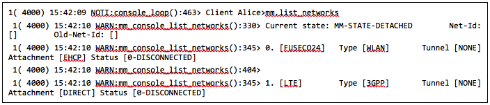

Figure: List of available networks

The mm.list_networks command returns the list of available networks and their current connectivity status.  The above example outputs shows that two networks are available and that the client is not connected nor attached to anyone. FUSECO24 is the SSID of the Wi-Fi access point in the FUSECO Playground.

**Connect to WiFi**

  ``mm.connect_l3 FUSECO24``

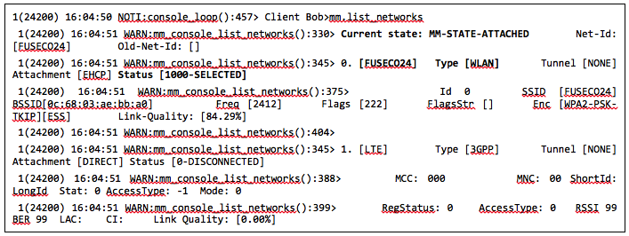

Figure: UE attached to Wi-Fi

*Verify connectivity:*

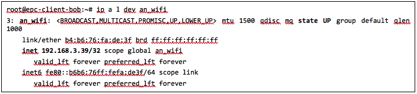

Figure: Example output of the Wi-Fi interface

In order to successful establish connections two things are required. First of all the network interface needs to have assigned an IP address from the 192.168.3.x/24 network after the attachment procedure, see figure 8 as example.  Second the routing needs to be properly configured, this could be verified while trying to ping a public IP address (e.g. ping 8.8.8.8). 

**Disconnect from Wi-Fi**

  ``mm.disconnect_l3 FUSECO24``

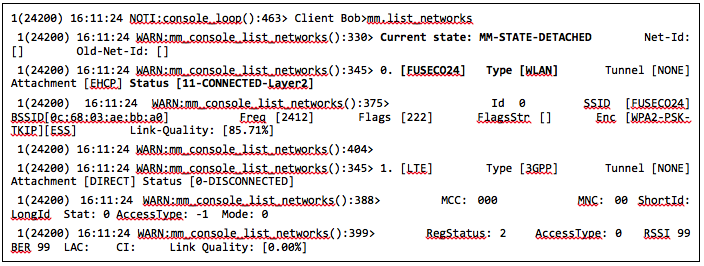

Figure: UE detached from Wi-Fi

**Connect to LTE**

  ``mm.connect_l3 LTE``

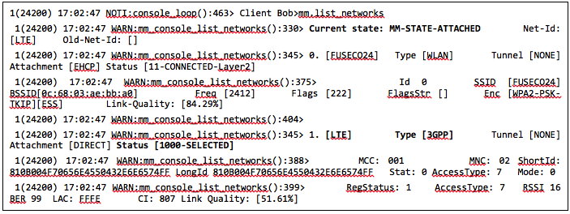

Figure: UE attached to LTE

*Verify connectivity:*

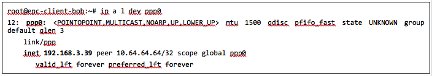

Figure: Example output of the LTE interface

The above figure show that after a successful LTE attachment a ppp0 interface was added by the operating system to establish the GTP tunnels. Furthermore it can be seen that the interface got an IP address assigned.  

**Handover LTE to Wifi**

The OpenEPC supports a zero packet loss vertical handover solution between 3GPP and non-3GPP access networks triggered by the mobility manager.

In order to trigger such a vertical handover from the mobility manager the experimenter has to execute the mm.connect_l3 <name_of_target_network> at the console. The software automatically establishes a connection to the new network, as soon this is established it detaches from the previous network, which results in a seamless user experience.  A detailed message flow diagram for the handover procedure can be found in the annex.

**Handover to LTE**

  ``mm.connect_l3 FUSECO24``

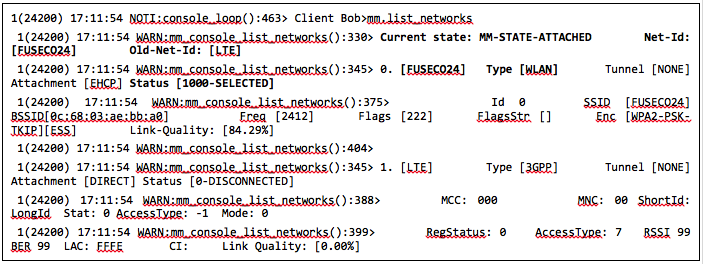

Figure: UE detached from Wi-Fi

The console output of the mm in the figure above show that the UE is now attached to WLAN. Highlighted in bold it has contains also the Old-Net-Id, which in this scenario is the previous access network LTE.

**OpenEPC Mobility Manager GUI**

The Mobility Manager GUI is a reference implementation of a network manager and generic client application, which demonstrates the use of the Mobility Manager. As the Mobility Manager runs typically completely in the background and should do most of its tasks transparently, the Mobility Manager GUI has the role of exposing to the user all the IP connectivity and operator pushed (over the S14 interface) information, as well as providing the user interface for configuring the behaviour of the Mobility Manager and for triggering manual hand-overs.

This GUI is limited in scope to demonstrative purposes and as code reference for development of mobile platform integrated functionality or mobile application add-ons. As such, the Mobility Manager can run also entirely without it and the client applications should connect themselves directly to the Mobility Manager API.

To remotely access the mobility manager GUI (MM-GUI) on a Linux UE a SSH connection with configured X-forwarding is required. 

Change to the MM-GUI location on the file system:

  ``ngniadm@epc-client-bob:~$ cd /opt/OpenEPC/mm_gui/``
  ``ngniadm@epc-client-bob:/opt/OpenEPC/mm_gui$``

**Start of the MM-GUI:**

  ``ngniadm@epc-client-bob:~$ ant run``

As soon the above command is executed a similar window see figure 12 should appear.

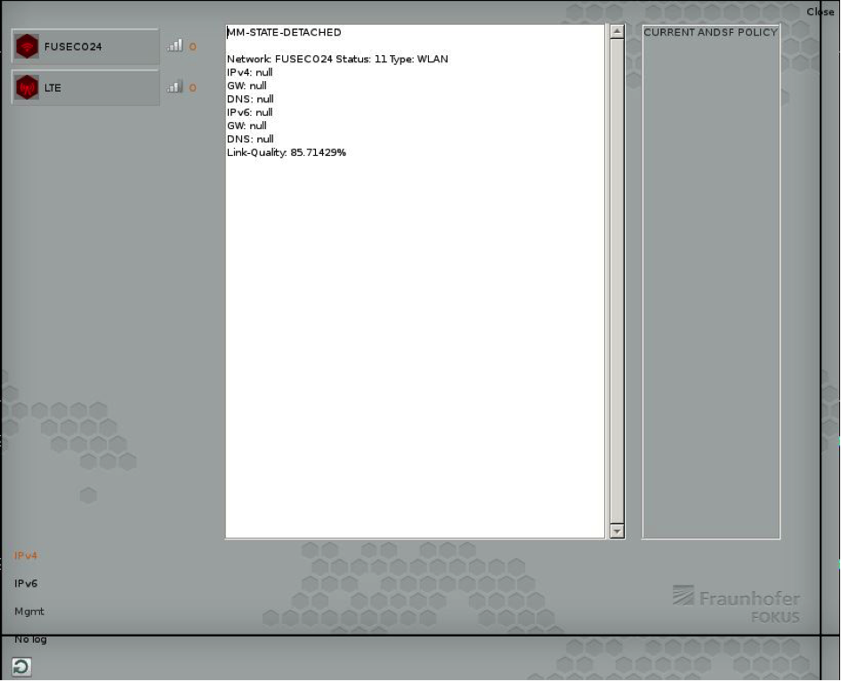

Figure: MM-GUI state: detached

The figure below depicts that two access networks are available including the link quality and the current connection status. Clicking on one access network will toggle the connection status.  

The color of the icon to the left indicates the current status of an access network connectivity:
* green: active and selected
* yellow: connection or handover in progress
* red: not connected
* gray: disabled

.. figure:: _static/mm-gui-attached.png 
Figure: MM-GUI state: attached (LTE)

Android UE
----------

The Android UEs are commercial off-the-shelf (COTS) devices that support LTE connections. A separation of management and data network traffic is not available for Android devices. In order to allow remote control of the smart phones, they are connected via USB to the Lenovo Tiny. Therefore, the experimenter needs to connect first to the Linux UE where the desired Android is attached, than using the Android Debug Bridge (ADB) for accessing the Android device. The Android with Charly user profile can be connected via Alice and David is connected to Bob.

Connect to Samsung Android phones using adb.

  ``adb shell``

**Control WLAN Connection**

To enable WLAN on an Android device execute the following command on a Linux UE that are able to establish the ADB connection:

  ``adb shell su -c svc wifi enable``

To verify the status of your connection you have to issue:

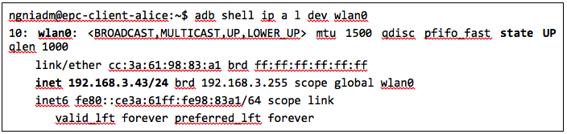

Figure: Example of attached Wi-Fi connection

Furthermore you could try to connect to a public available IP address:

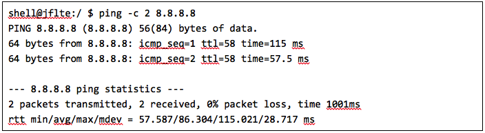

Figure: Verify LTE connection to the Internet

To disable WLAN run:

  ``adb shell su -c svc wifi disable``

To verify the status of your connection you have to issue:

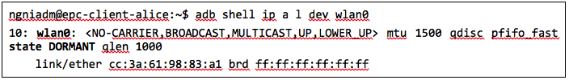

Figure: Example of detached Wi-Fi connection

If the UE is attached the particular network interface (wnal0) has an IP address assigned from the access network (192.168.3.x/24).

**Control LTE Connection**

To enable LTE connectivity on an Android device execute the following command on a Linux UE that are able to establish the ADB connection:

  ``adb shell su -c svc data enable``

To verify the status of your connection you have to issue:

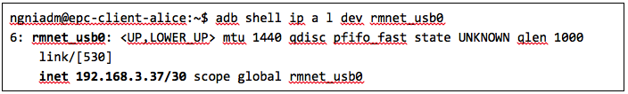

Figure 1: Example of attached LTE connection

The dedicated network interface for LTE connectivity is rmnet-usb0, see figure 16, and has an assigned IP address.

To disable mobile data run:

  ``adb shell su -c svc data disable``

\*Note: If you want mobile data to be used you have to disable WLAN

To verify the status of your connection you have to issue:

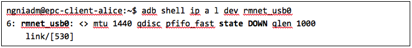
Figure: Example of attached LTE connection

Access Network
==============

eNodeB
------

The FUSECO Playground access network consists of the same physical eNodeB from ip.access as the NILAB [8] and iMinds [9] LTE testbeds. Therefore we have adopted the LTErf implementation done in FLEX to control the ip.access eNodeB. Table 1 gives a short feature summary. For further details investigate the LTErf documentation provided at [10].

================================= ================================ ========================================
Feature                           Example                          Description
================================= ================================ ========================================
Management of configuration files bs/config/list                   Basestation configuration can be listed, loaded, updated or deleted using XML files
Restart basestation               bs/restart?node=..               Restarts basestation
General information               bs/info?node=..                  Returns general information about the basestation
Get/Set Wireless Parameters       bs/get?freqBandIndicator&&node=1 Gets/sets wireless parameters on the basestation
Reporting for CQI and UEs         bs/set?param=UEReport=1&&node=1  Enable / disable reporting for CQI and UEs
Get/Set Power Control Parameters  bs/get?PUSCHPowerControl&&node=1 Gets/sets Power Control parameters on the basestation
Get/Set EPC Parameter             bs/get?epcIpAddress&&node=1      Gets/sets EPC parameters on the basestation
Get/Set LTE AP parameters         bs/get?eNBName&&node=1           Gets/sets LTE Access Point parameters on the basestation
================================= ================================ ========================================

Table: Access Network Features

ACS
---

As the ip.access LTE245F eNodeB supports the TR-069 protocol [11], it was aimed to provide remote configuration of the ip.access eNodeB through an Auto-Configuration Server (ACS). At the time of writing this deliverable, two ACS implementations are under evaluation. One implementation of a CPE WAN Management Protocol (CWMP) [12]  ACS was implemented by Fraunhofer FOKUS and another ACS is available from ip.access. Both system can be used to configure and control TR-069 capable devices. 

The basic configuration required to commission an AP to allow it to connect to a TR-069 ACS is in a small database in the /sysconfig/commonstate.db file. The AP uses this information to establish the connection to the ACS.

The configuration stored in the femto.db database file is detailed below: 

=========== ========================================================================================== ====================================
Name        Note                                                                                       Database details
=========== ========================================================================================== ====================================
Enable CWMP TR069 client functionality enabling flag                                                   T = FeatureActivation

            Note: This value is overridden at startup with that from the commonstate.db database file. P = EnableCWMP

                                                                                                       V = 1

ACS Server  This corresponds to the address of the ACS.                                                T = SysConfigInfo

            Note: This value is overridden at startup with that from the commonstate.db database file. P = AcsUrl

                                                                                                       V = \'http://172.20.3.167:7547/ACS/test\'
=========== ========================================================================================== ====================================

Table: TR-069 configuration at femto.db


The configuration stored in the commonstate.db database file is detailed below: 

============== ============================================================= =================
Name           Note                                                          Database details
============== ============================================================= =================
TR-069 Enabled Controls whether the TR-069 client is enabled (1) or not (0). T = SysConfigInfo

                                                                             P = Tr069Enabled

                                                                             V = 1
ACS URL        This address is used by the AP to perform the initial INFORM  T = SysConfigInfo
               procedure during which the AP receives the rest of its        
               configuration.                                                P = AcsUrl

                                                                             V = \'http://172.20.3.167:7547/ACS/test\'
CPE URL Port   Defines the port on which the AP listens for TR-069           T = SysConfigInfo
               Connection Requests from the ACS.                             
                                                                             P = CpeUrlPort

                                                                             V = 51005
============== ============================================================= =================

Table: TR-069 configuration at commonstate.db

In order to provide control of the radio layer, an attenuator is a great equipment to modify the signal strength and simulate the distance between UE and access point. To make sure that the UE is only receiving the expected signals with no interference it needs to be shielded from the existing surrounding radio signals. The following figure describes in more details the setup.

One of the Android UEs can be placed into the shield box. Remote access to the device can be established though the ADB as described above in the Android UE section. The attenuator can be controlled via a TCP connection (e.g. netcat, telnet) sending device specific commands. The following list introduces a selection of available capabilities of the attenuator.

+-------------------------------------------------------+-------------------------------+----------------------------------+
|Command                                                | Example                       | Description                      |
+=======================================================+===============================+==================================+
| RAA                                                   | RAA                           | Read all attenuators Response    |
|                                                       |                               |                                  |
| Read the current attenuation value of all attenuators | Checksum = 0x6c49             |                                  |
|                                                       |                               |                                  |
|                                                       | Atten #1 = 2dB                |                                  |
|                                                       |                               |                                  |
|                                                       | Atten #2 = 0dB                |                                  |
|                                                       |                               |                                  |
|                                                       | Atten #3 = 0dB                |                                  |
|                                                       |                               |                                  |
|                                                       | Atten #4 = 0dB                |                                  |
|                                                       |                               |                                  |
|                                                       | Atten #5 = 0dB                |                                  |
|                                                       |                               |                                  |
|                                                       | Atten #6 = 0dB                |                                  |
+-------------------------------------------------------+-------------------------------+----------------------------------+
| RA                                                    | RA 1,2                        | Read attenuators 1, 2 Response   |
|                                                       |                               |                                  |
| Read the current attenuation value for single or      | Atten #1 = 2dB                |                                  |
| multiple attenuators                                  |                               |                                  |
|                                                       | Atten #2 = 0dB                |                                  |
+-------------------------------------------------------+-------------------------------+----------------------------------+
| SA                                                    | SA 1 10, 2 20                 | Set single or list  of           |
|                                                       |                               | attenuators to dB value          |
| Sets attenuator 1 to 10dB and attenuator 2 to 20 dB   +-------------------------------+----------------------------------+
|                                                       | SA -MTR 1, 3, 5               | Set attenuators 1, 3, 5 to       |
|                                                       |                               | maximum attenuation and          |
|                                                       | [17:22:52] Atten #1 = 127dB   | respond incl. timestamp          |
|                                                       |                               |                                  |
|                                                       | [17:22:52] Atten #3 = 127dB   |                                  |
|                                                       |                               |                                  |
|                                                       | [17:22:52] Atten #5 = 127dB   |                                  |
+-------------------------------------------------------+-------------------------------+----------------------------------+
| FA                                                    | FA 5 127 0 1S STEP 2          | Fade attenuator 5 from 127dB to  |
|                                                       |                               | 0dB at 2dB steps every 1Sec      |
| Fade attenuator x from y dB to z dB over interval     | Fade Started                  |                                  |
| time t                                                |                               |                                  |
|                                                       | Fade Finished                 |                                  |
| Step size defaults to attenuator’s dB step size       |                               |                                  |
+-------------------------------------------------------+-------------------------------+----------------------------------+

Table: Feature list attenuator

The table shows some use examples of the capabilities from the JWF attenuator. For more detail please have a look at the documentation [13] from JFW industries. 

Core Network
============

The FUSECO Playground provides an OpenEPC Rel. 5 developed by Fraunhofer FOKUS [14]. OpenEPC is a prototype implementation of the 3GPP Release 8 Evolved Packet Core (EPC) that will allow academic and industrial researchers and engineers around the world to obtain a practical look and feel of the capabilities of the Evolved Packet Core. OpenEPC can be integrated with various access network technologies and different application domains and thus provides an excellent foundation for experimentation.

Due to licensing policies the OpenEPC can be only used as a service with no direct access to the host where the EPC services are running. The LTE testbed is already pre-configured which enables ready to go experimentation. However, the OpenEPC is remotely accessible though the LTErf extentions, implemented within this project. The following table gives an overview about the available features. Additional features could be implemented based on the demand of upcoming experiments.

EPC feature list:

================================= ========================================= ==================
Feature                           Example                                   Description
================================= ========================================= ==================
Management of configuration files epc/get?function=getMMEConfiguration      EPC configuration is loaded from a particular XML files, individually to each EPC component.
Component status                  epc/get?function=getSystemStatus&args=... A general information about status information, like ACTIVE, for EPC components.
Start/Stop services               epc/restart?type=...                      Start or stop all EPC core services
General subscriber information    epc/get?function=getSubscriberList        Returns the number of subscribers currently attached to the EPC
Detailed subscriber information   epc/get?function=getSubscriber&args=...   Highly detailed status information (APN; DL/UL capacity; bearer information) of a specific subscriber
User provisioning                 epc/set?function=addSubscriber&args=...   HSS subscribers management (Add; update; list; delete)

                                                                            Subscriber profile management (Add; update; list; delete)
eNodeB provisioning               epc/get?function=getENodeBList            Return the list of configured eNodeB

                                                                            Additional eNodeB register automatically to MME
================================= ========================================= ==================
