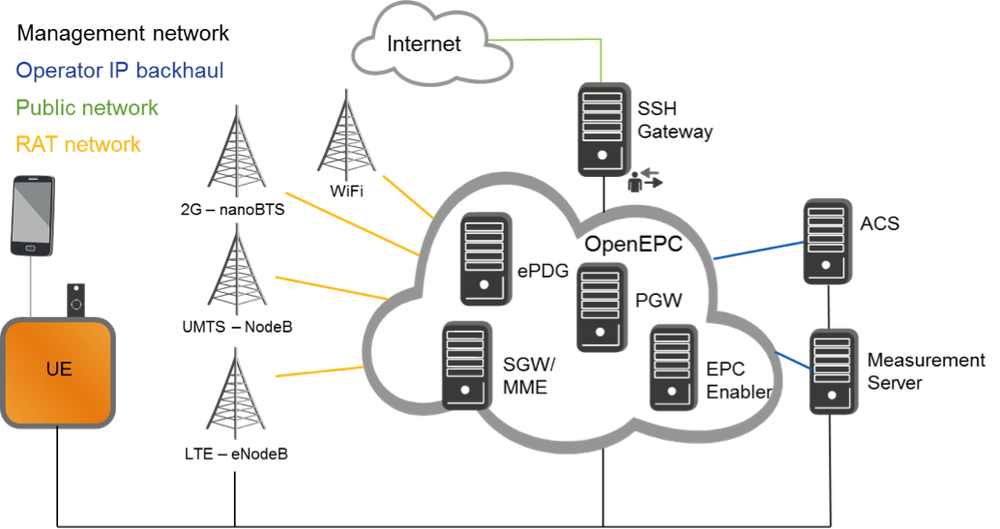
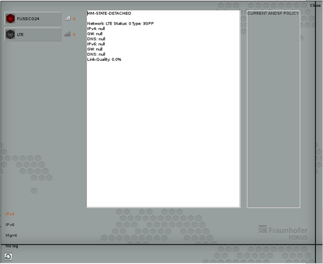
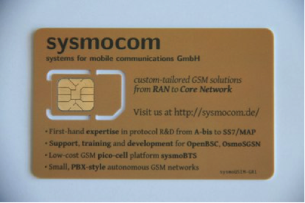
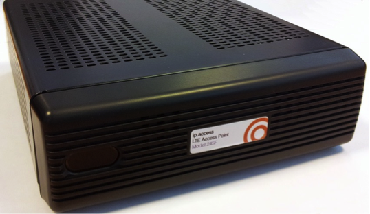
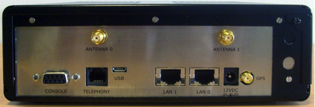

.. _resourcedetails-label:

```````````````````````````````
FUSECO Playground Resource Description
```````````````````````````````

.. contents:: Table of Contents

LTE Access Network Deployment
=============================

The LTE Access Network of the FUSECO playground is an indoor deployment at the Fraunhofer FOKUS building located in Berlin. The currently used eNodeB is LTE 245F femto cell from ip.access. Due to strict regulations in Germany we are temporarily allowed to operate the cell using the following frequencies:

1.	LTE 800 / Telefonica: DL: 791 -- 780 MHz; UL: 832 -- 842 MHz (2x5MHz)
2.	LTE 800 / Telekom: DL: 811 -- 821 MHz; UL: 852 -- 862 MHz (2x5MHz)
3.	LTE 2600 / Telekom: DL: 2640 -- 2660 MHz; UL: 2520 -- 2540 MHz (2x5MHz)
4.	LTE 2600 / Telefonica: DL: 2670 -- 2690 MHz; UL: 2550 -- 2570 MHz (2x5MHz)

Furthermore there are some restrictions to use the aforementioned frequencies. Operation is only allowed indoor with maximum 10mW ERP.

The testbed (see Figure 1) consists of multiple physical nodes that are deployed to support end2end LTE experiments. The UEs are supporting the connectivity to the available radio access technologies of the testbed. The FUSECO playground is providing 2G, 3G and 4G radio access besides WiFi. Technical details regarding the femto cells can be found in the annex. The EPC core network is deployed on multiple physical servers which hosts the `OpenEPC <http://www.openepc.com/>`_ software. The operator backhaul network contains multiple physical servers that provide additional features that could be required for experimentation. Additional servers can be added if needed for specific experiments. All nodes are connected to the central management network, which can be used for remote access. 


Figure: FUSECO LTE architecture deployment


LTE Evolved Packet Core Network Deployment
==========================================

The FUSECO playground is currently operating an OpenEPC release 5. OpenEPC  is a prototype implementation of the 3GPP Release 8 Evolved Packet Core (EPC) that will allow academic and industrial researchers and engineers around the world to obtain a practical look and feel of the capabilities of the Evolved Packet Core. OpenEPC can be integrated with various access network technologies and different application domains and thus provides an excellent foundation for own research activities and/or the establishment of Next Generation Mobile Network (NGMN) testbeds. OpenEPC was developed by Fraunhofer FOKUS competence center NGNI and TU Berlin - AV. 

The Auto-Configuration Server (ACS) is described below.


LTE UEs
=======

The FUSECO Clients are Lenovo M93 Tiny, which support multiple operating systems as well as different radio access technologies. There are several LTE USB dongles available that can be attached to the FUSECO Clients.

It is planned to support remote access to Android devices (e.g. smartphones) that are connected to the FUSECO Clients. Furthermore the OpenEPC Mobility Manager (see Figure 2) is installed at the aforementioned client to handle attachments, detachments and handovers. Additionally the Mobility Manager measures the signal strength of WiFi and LTE equipment attached. 


Figure: Screenshot Mobility Manager

Further details about the LTE UE’s are given below:

======================= ================= =============================================================================================
LTE UE                  Available Devices Technical Specifications
======================= ================= =============================================================================================
Huawei K5005            2                 Chipset: Qualcomm MDM9200TM
                                          4G LTE 800/2600MHz
                                          3G-4G DC-HSPA+/HSUPA/HSDPA/UMTS/WCDMA - (900)/2100MHz.
                                          2G GSM/GPRS/EDGE - 850/900/1800/1900MHz.
                                          2×2 MiMo, LTE category 3
                                          Data Speed: Download up to 100 Mbps, Upload up to 50 Mbps at 20MHz bandwidth
                                          Memory: MicroSD card slot up to 32GB.
                                          HSUPA, HSPA + and dual-carrier HSPA + and Receive Diversity
                                          GSM with EDGE support
                                          Display: LED Indicator.
                                          Antenna: Integral antenna & 2XExternal antenna interface.
Huawei E3276s-150       3                 Integrated modem HiSilicon with the new chipset Hi9620
                                          4G LTE800/LTE900/LTE1800/LTE2100/LTE2600 MHz
                                          Downstream up to 150 Mbit/s, with LTE Category 4
                                          Upstream up to 50 Mbit/s, with LTE Category 4
                                          Backwards compatibility: supports 3G UMTS, DC-HSPA+ at up to 43.2 Mbit/s
                                          Backwards compatibility: supports 2G GSM and EDGE 850, 900, 1800 and 1900 \*\*z
                                          very high connection quality
                                          USB connector can be swiveled and locked in the housing
                                          Slot for MicroSD memory cards with max. 32 MB
                                          SIM card slot in standard size, microSIM and Nanosim need a SIM adapter
Samsung Galaxy I9500 S4 2                 2G - GSM 850 / 900 / 1800 / 1900 
                                          3G - HSDPA 850 / 900 / 1900 / 2100 
                                          4G - LTE 700 / 800 / 1700 / 1800 / 1900 / 2600 MHz 
                                          Android OS, v4.2.2 (Jelly Bean), v4.3, upgradable to v4.4.2 (KitKat) 
                                          Chipset: Exynos 5 Octa 5410 
                                          CPU: Quad-core 1.6 GHz Cortex-A15 & quad-core 1.2 GHz Cortex-A7 
                                          GPU: PowerVR SGX544MP3 
                                          Sensors: Accelerometer, gyro, proximity, compass, barometer, temperature, humidity, gesture 
                                          Achievable throughput: HSDPA, 42.2 Mbps; HSUPA, 5.76 Mbps; LTE, Cat3, 50 Mbps UL, 100 Mbps DL
                                          WiFi: Wi-Fi 802.11 a/b/g/n/ac, dual-band, Wi-Fi Direct, DLNA, Wi-Fi hotspot
======================= ================= =============================================================================================

Table: LTE UE's


LTE SIM cards
=============

The SIM cards used for the LTE testbed are the Sysmocom programmable sysmoUSIM-GR1 (see Figure 3). The sysmoUSIM-GR1 is a standards-compliant UMTS UICC card. It supports the 3GPP MILENAGE authentication algorithm and the cards IMSI, ICCID, K and OPC values can be programmed/changed.


Figure: FUSECO SIM cards

Further details are given in the table below:

====================== ======== =========================
SIM Card model         Quantity Technical Specifications
====================== ======== =========================
Sysmocom sysmoUSIM-GR1 5        Authentication algorithm : Milenage
                                K  : 00000000000000000000000000000000
                                OP   : 00000000000000000000000000000000
                                OPc : 00000000000000000000000000000000
                                IMSI ranges : 001011234567890 - 001011234567894
====================== ======== =========================

Table: SIM Cards

Femto Cells
===========
	
The Base Stations we use are commercial off-the-shelf elements. Usually they support basic functionality.

ip.access LTE 245 F femtocells
^^^^^^^^^^^^^^^^^^^^^^^^^^^^^^


Figure: LTE245 Access Point

It is dual band capable and is available in 3GPP Bands 1/13, 4/13, 2/5 or 7/13. Supporting 2x2 MIMO with an output power of +10dBm per port, the 245 provides comprehensive LTE operation in a compact form factor.

Table: LTE 245F Key Features:

=========================== ==================================
Features                    Details
=========================== ==================================
3GPP Compliance             Compliant to 3GPP Rel 8.9.0
Number of RF Carriers       Single Carrier
3GPP Band Support           3GPP Band Support Dual Band 1/13, 4/13, 2/5 or 7/13.
Bandwidth                   10MHz
MIMO                        2x2 MIMO-Single User Downlink only
RF Average Output Power     2 x 10dBm
Modulation/Coding           16QAM U/L and D/L
Max Data Rate Throughput    13Mbps	Max Data Rate Throughput 13Mbps
Simultaneous # Active Users 4
Simultaneous # Idle Users   64
Network Interfaces          S1 over IP
Electrical Supply           12V @ 5.5A from external power brick
=========================== ==================================

**RF Capabilities**

The 245 offers dual band LTE capability within a single hardware SKU. Operation is on one band at a time (i.e. not simultaneous dual band operation) as configured by via the OAM interface. A reboot is currently required when changing the OAM configuration.
The RF subassembly used in the 245 has a maximum rating of 2 x 13dBm. However, for normal and continuous operation, the 245 should be configured such that RF output power does not exceed 2 x 10dBm unless additional heat-sinking measures have been applied.

**Throughput Performance**

The 245 platform is capable of high speed data transfer to LTE capable devices. Currently specified performance of Air Interface data rate is 13Mbps, which can be achieved for a single active user with a small rate reduction when 2 users are active. Further rate reduction is to be expected when the cell is loaded with additional users. The platform is software upgradeable to support operation up to 100Mbps downlink aggregate throughput, using 64 QAM.

**Mobility**

Idle mode mobility between the 245 and surrounding LTE or UMTS 3G cells is supported. The platform is software upgradable to support Active Mode handover.

**Operational Range**

Useful cell radius is a function of many variables including antenna types, number of users, throughputs and so on. The 245 is specified to support 900m range in terms of its baseband capability.

**GPS**
The 245 is supplied with integrated GPS hardware. In principle this could be used for various functions such as location and synchronisation subject to appropriate software support (not currently supplied).

**Network Interfaces**
The ‘S1’ network interface is presented via two 1Gbps Ethernet ports.

Physical Interfaces
 

Figure: LTE245 LTE femto cell

The following physical interfaces are presented on the enclosure panel:

* DC power jack
* 2 off RJ45 Ethernet
* Micro USB
* 2 off SMA female RF
* 9-way RS-232 serial Console port
* GPS receptacle (not used)
* Telephony/modem port (not used)

ip.access Nano3G E16 (model 239A) UMTS IMT 2100
^^^^^^^^^^^^^^^^^^^^^^^^^^^^^^^^^^^^^^^^^^^^^^^

The full +24 dBm (250mW) output power gives the E-class picocells the range to cover medium and large office buildings, and for the largest deployments the E-class can connect directly into an active DAS system. The flexibility is further enhanced by the high precision oscillator, giving fast start up in areas where no macro network can penetrate.

Features:

* Up to 16 simultaneous active users - (each with concurrent voice and high-speed data sessions)
* +24 dBm (250mW) output power
* Available for Bands 1, 2/5 and 4

ip.access nanoBTS (DCS 1800)
^^^^^^^^^^^^^^^^^^^^^^^^^^^^

Each nanoBTS is a single TRX which can support up to 14 simultaneous voice calls using dynamic AMR with half-rate. For high traffic locations, where even greater capacity is needed, up to 4 nanoBTS can used to create a 2, 3 or 4 TRX cell. The nanoBTS picocell offers:

* Controllable output power up to 23dBm giving an indoor range up to 200m
* Simple deployment with a single Ethernet connection for power, traffic and signalling
* GPRS and EDGE data essential Blackberry® and enterprise applications
* Models for the 850, 900, 1800 and 1900MHz bands
* Network Listen™ to optimize handover configuration
